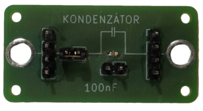
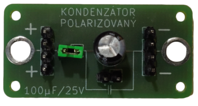
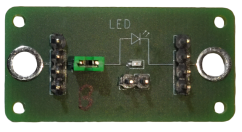
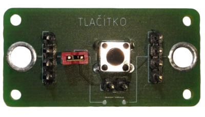
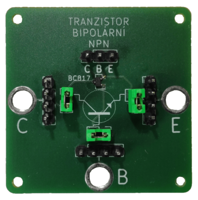

# O co jde?

Electron je stavebnice pro výuku základních znalostí elektroniky.
Jednotlivé elektronické součástky jsou umístěny na samostatných deskách plošných spojů.

Spojování probíhá pomocí drátů, které se zasunou do předchystaných děr a zajistí se gumovými špunty. Alternativně jsou nachystány pinheady pro případné použití "čínských" kabelů s dutinkami.

## Schématické značky

|	Název		            |			Značka			|			Electron			 |
| -------------             | ------------------------- | ------------------------------ |
|Zdroj		            	|||
|Rezistor		            |||
|Kondenzátor	            |||
|Kondenzátor polarizovaný   |||
|LED    		            |||
|Tlačítko		            |||
|Přepínač		            |||
|Potenciometr	            |||
|Tranzistor NPN             |||
|Tranzistor PNP             |||

## Správné zapojování kabelů k součástkám

