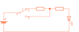

# Electron lekce 1

## 1. Tlačítko, rezistor a LED

Obvod obsahuje zdroj elektrického napětí, spotřebič – LED, rezistor, který omezuje proud procházející diodou, spínací tlačítko a spojovací vodiče. 
Spojte na panelu zdířky dle schématu. 

Po zmáčknutí tlačítka se rozsvítí LED. Stiskem tlačítka se spojí jeho kontakty a uzavře se elektrický obvod. Elektrický proud teče po dobu stisku tlačítka od plus (+) pólu baterie přes propojené součástky k minus (-) pólu baterie. Ve schématu je dioda zapojena v propustném směru neboli propouští proud a ten ji rozsvěcuje. Po uvolnění tlačítka se elektrický obvod přeruší, proud přestane procházet a LED zhasne. 

Nyní zkuste připojit LED obráceně (prohoďte vzájemně konce vodičů upevněné ve zdířkách). Dioda je nyní zapojena v závěrném směru, nepropouští proud, a tedy po zmáčknutí tlačítka nesvítí. 

Ověřili jste si tak základní vlastnost polovodičové diody – propouští proud jen v jednom směru. Tímto jednoduchým zapojením si můžete vždy, když máte pochybnosti, ověřit, jestli jsou jednotlivé diody v pořádku.

Můžete rozsvítit červenou, žlutou nebo zelenou diodu. 

POZOR! Je nutné, aby v obvodu s LED byl vždy zařazen omezovací rezistor. Pokud byste připojili LED v propustném směru přímo na zdroj napětí – baterii, zcela jistě byste LED zničili.

### Měřené hodnoty

**Napětí** na diodě je nižší než na vstupu. Je to způsobeno rezistorem, který snižuje protékající proud a napětí. Napětí na LED by mělo být zhruba **2 V**. 
**Proud** procházející LED je přibližně **16 mA**, což stačí na to, aby se LED rozsvítila. 

## 2. Sériové zapojení rezistorů

Vlastnosti sériového spojení rezistorů si můžete ověřit na modelu dle schématu. Po zapojení se rozsvítí. Pokud je přepínač v poloze nahoře, proud musí procházet oběma rezistory, z nichž každý svým dílem zmenšuje celkový proud v obvodu a LED svítí slaběji. Pokud přepnete přepínač do spodní polohy, proudu se do cesty nestaví rezistor 560 Ω a protéká tak pouze rezistorem 180Ω. Souhrnný odpor je tak menší, a proto je proud větší, a LED svítí silněji. V tomto schématu jsou zařazeny v sérii dva rezistory, ale je možno takhle za sebou propojit rezistorů více. Výsledný odpor R sériové kombinace rezistorů se rovná součtu hodnot jednotlivých rezistorů, v našem případě R = R3 + R2 = 560 + 180 = 740 Ω

### Měřené hodnoty

**Napětí** na LED, při pozici přepínače v poloze dole, by mělo být zhruba **2 V**, v poloze nahoře je to o něco méně **1,9 V**. 

**Proud** procházející LED při pozici přepínače v poloze dole, je stejný jako v prvním příkladě, tedy **16 mA**, v poloze nahoře je to o dost méně skoro **4,3 mA**, což stále stačí na to, aby se LED rozsvítila.

## 3. Paralelní zapojení rezistorů

Na tomto zapojení si můžete vyzkoušet, jaké vlastnosti bude mít zapojení rezistorů paralelně (souběžně) neboli vedle sebe. Zapojte obvod podle schématu. Rozsvítí se LED a po stisku tlačítka se rozsvítí silněji. Vysvětlení je následující: pokud je tlačítko rozepnuto, proud prochází přes rezistor a rozsvěcuje LED poněkud slaběji. Po stisknutí tlačítka začne proud procházet oběma rezistory současně a je proto větší. To se projeví zvětšením jasu LED.

Pro snadnější pochopení principu si představte situaci, kdy jedněmi dveřmi proudí do kina zástup lidí. V okamžiku, kdy se otevřou druhé dveře, začnou vcházet lidé i těmito dveřmi a kino se začne plnit rychleji.

Vraťme se k našemu schématu. V sériovém zapojení podle návodu č.2 byl výsledný odpor větší než odpor kteréhokoli použitého rezistoru. Paralelně můžeme spojit dva i více rezistorů. Výsledný odpor je vždy menší než hodnota nejmenšího z rezistorů zapojených paralelně. Přesně se výsledný odpor R v našem schématu vypočte podle vztahu:

{align=center}

