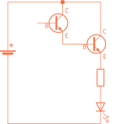

# Electron lekce 3

## 10. Experiment s tranzistorem

Tranzistor je polovodičová součástka se třemi vývody, které se nazývají báze, ve schématu označená jako(B), kolektor (C) a emitor (E).

Nejčastěji se tranzistor používá jako zesilovač elektrického proudu, jinak řečeno, prostřednictvím tranzistoru můžeme malými změnami proudu I tekoucího do báze tranzistoru vyvolávat velké změny proudu Ic tekoucího do kolektoru tranzistoru. Zjednodušeně lze také říct, že tranzistor představuje mezi kolektorem a emitorem odpor, jehož hodnotu lze měnit elektronicky (nikoli mechanicky, jako u potenciometru) velikostí proudu I, který teče do báze. Běžné tranzistory zesilují více než 100 krát, takže k sepnutí proudu Ic = 100 mA stačí, aby do báze tekl proud 1 mA. Proud v našem modelu teče podle schématu od plus pólu zdroje (baterie) a dělí se na proud tekoucí do báze přes odpor R a proud tekoucí do kolektoru přes LED a ochranný odpor R- Mezi bází – emitorem se chová tranzistor jako dioda v propustném směru, zjednodušeně můžeme říci, že má zanedbatelný odpor. Proud báze je tedy určen velikosti odporu připojeného k bázi (Čím větší odpor, tím menší proud).

Zapojte si nyní obvod podle obrázku na levé straně, zjistíte, že žlutá LED sotva znatelně svítí. Proud, který teče LED přes odpor 100 kΩ je příliš malý. V zapojení napravo stačí tento malý proud, protékající přes stejný odpor 100 kΩ do báze, k sepnutí tranzistoru, neboli ke zmenšení jeho odporu mezi kolektorem a emitorem natolik, že se LED rozsvítí. Zkuste nyní odpojit drát ze zdířky báze tranzistoru. LED zhasne, neboť jste odpojili proud do báze a tranzistor se rozepnul. Chytněte nyní odpojený vodič prsty za odizolovaný konec a druhou rukou se dotkněte zdířky báze tranzistoru, LED se rozsvítí, pokud ne, mírně si navlhčete prsty a znovu se dotkněte. Tělo totiž představuje rovněž elektrický odpor, kterým projde proud postačující k sepnutí tranzistoru v našem zapojení.

Pokud budete s tranzistorem experimentovat, dbejte, aby do báze tekl proud vždy přes odpor. Stejně jako u LED byste velkým proudem přímo z baterie tranzistor zničili.

## 11. Jednoduchý tranzistorový zesilovač

V mnoha případech, kdy je vstupní signál, který máme k dispozici, příliš malý na to, aby sepnul tranzistor, je nutno propojit několik tranzistorů za sebou, aby se celkové zesílení obvodu zvýšilo.
Jednoduchý zesilovač- tzv. Darlingtonovo zapojení je na schématu. Po zapojení se dotkněte zdířky báze T a přibližte se k nějakému (i vypnutému) elektrickému spotřebiči nebo kabelu. LED se rozsvítí, přestože do báze T zdánlivě neteče žádný proud. Vaše tělo nyní působí jako anténa pro okolní elektromagnetické pole a dotekem prstu přivedete do báze T proud velikosti deseti-tisícin mA, který ovšem stačí k pootevření tranzistoru T. Zesílený proud vycházející z emitoru T a vstupující do báze T stačí k sepnutí tranzistoru T a rozsvícení červené LED. Přestože se zdá, že při doteku LED svítí trvalým jasem, vlastně bliká, a to v rytmu změn okolního elektromagnetické pole, které mění svoji intenzitu stejně jako napětí a proud v elektrické síti 50 krát za sekundu. Změny jsou ovšem na lidské oko příliš rychlé, a proto vnímáme jas LED jako stálý. Pokud chcete toto blikání vidět, pohybujte panelem zlehka kývavě do stran od kabelu a sledujte LED.

## 12. Tranzistorový oscilátor

Zapojte obvod podle schématu. Obvod je už poněkud složitější, proto proveďte dílčí kontrolu po zapojení části oscilátoru, abyste snížili riziko chyby v celkovém zapojení a kontrolu po zapojení celého obvodu. Pokud jste si jisti, můžete připojit baterii. Stiskněte tlačítko a začnou blikat LED.

Co se v tomto zařízení odehrává? Po stisku tlačítka se přivede napájení k obvodu, jehož součástky a způsob zapojení je zvolen tak, aby v něm došlo ke kmitům, neboli aby se samočinně střídavě spínaly jeden nebo druhý tranzistor. Na kolektor T je s odporem R 560 Ω připojena LED, takže když je právě sepnut tento tranzistor, teče do kolektoru proud přes odpor R a LED a ta se rozsvítí. V okamžiku, kdy se T vypne, přestane do jeho kolektoru téci proud a LED zhasne.

## 13. Jednoduché poplašné zařízení

Zapojte obvod podle schématu. Je dobré provést dílčí kontrolu po zapojení části oscilátoru, kdy není na panelu ještě mnoho vodičů, sníží se tak riziko chyby v celkovém zapojení. Máte-li obvod celý zapojen a zkontrolován, připojte baterii a přepněte přepínač do polohy nahoře. Pokud jsou konce poplašných vodičů rozpojeny, rozsvítí se červená LED. Pokud konce poplašných vodičů spojíme, LED zhasne. Nyní můžete konce poplašných vodičů šikovně přilepit třeba na šuplík u stolu, který chcete hlídat nebo zatížit kontakty hlídanými předmětem a čekat až se někdo "chytí".

