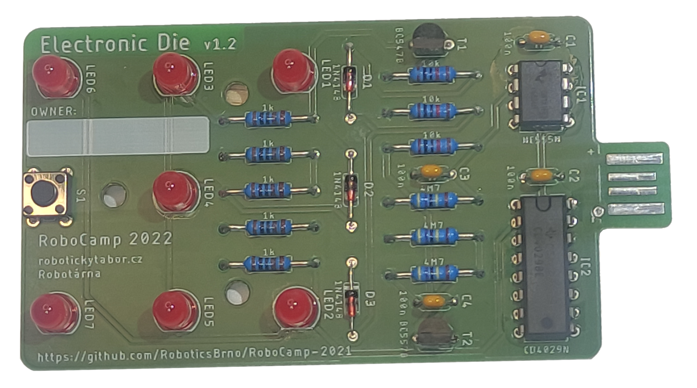

# O co jde?

Elektronická hrací kostka je jednoduché elektronické zařízení, které vám nahradí klasickou hrací kostku.
Ovládá se jedním tlačítkem na desce, kterým můžete zapnout losování čísla. Jakmile vám jedno číslo padne, bude na kostce svítit až do dalšího hodu.

Tak směle házejte a nebojte se zahrát si spolu třeba kostky.

