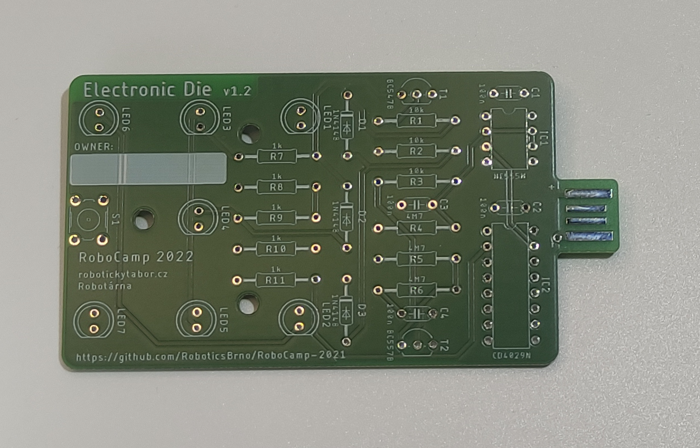
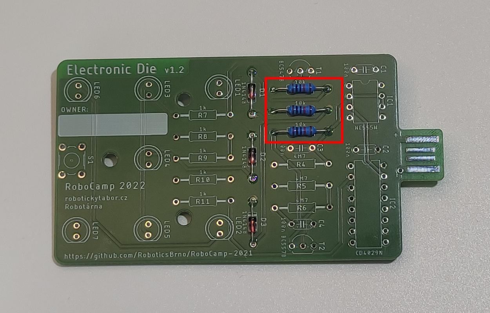
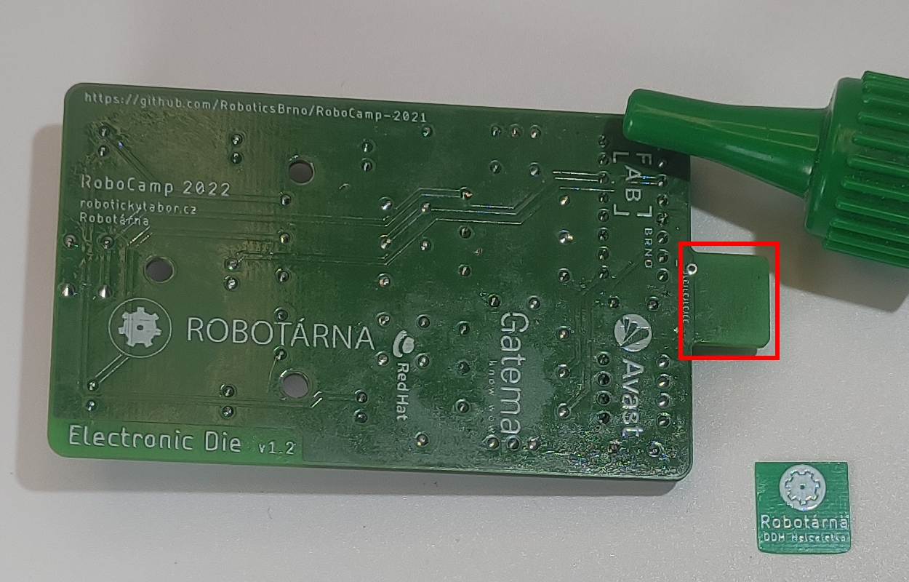
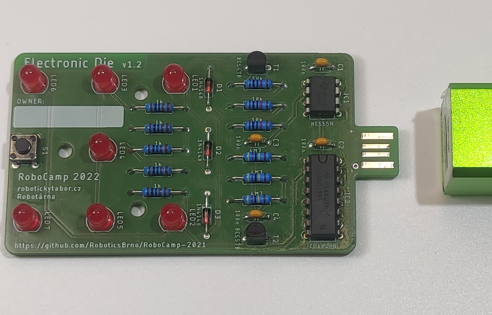

# Návod

## Potřebný materiál
- Deska plošných spojů
- 3 Diody 1N4148
- 3 rezistory 10kΩ
- 3 rezistory 4.7MΩ
- 5 rezistorů 1kΩ
- 4 kondezátory 100nF
- 1 tranzistor BC547B
- 1 tranzistor BC557B
- 7 LED
- tlačítko
- 2 integrované obvody (CD4029N a NE555N)
- podložku pod USB konektor

## Návod na složení
 
1. Připravíme si desku pro hrací kostku

 
2. Osadíme 3 diody <b>1N4148</b> (D1, D2, D3). <b>Pozor na polaritu!</b> Je třeba mít černý proužek na diodě na stejné straně, jako je naznačeno bílým proužkem na desce.

 
3. Osadíme 3 rezistory <b>10 kΩ</b> (R1, R2, R3) 

 
4. Osadíme 3 rezistory <b>4.7 MΩ</b> (R4, R5, R6)

 
5. Osadíme 5 rezistorů <b>1 kΩ</b> (R7, R8, R9, R10, R11)

 
6. Osadíme 4 kondenzátory <b>100 nF</b> (C1, C2, C3, C4)

 
7. Osadíme 1 tranzistor <b>BC547B</b> (T1) <b>Je třeba dodržet orientaci dle naznačení na desce!</b>

 
8. Osadíme 1 tranzistor <b>BC557B</b> (T2) <b>Opět je třeba dodržet otočení dle nákresu na desce!</b>

 
9. Osadíme 7 <b>červených LEDek</b> (LED1, LED2, LED3, LED4, LED5, LED6, LED7) <b>Je třeba dodržet otočení dle nákresu na desce!</b>

 
10. Osadíme <b>tlačítko</b> (S1)

 
11. Osadíme 2 <b>integrované obvody</b> (IC1, IC2) <b>Je třeba dodržet orientaci! Kolečko na pouzdře obvodu musí být v levém horním rohu na desce!</b> Pokud si nejste otočením jisti, zeptejte se raději lektora.
<!--  
12. 

 -->

<!--  
29. 

 -->

 
12. Připravíme si vteřinové lepidlo a podložku pod USB konektor

 
13. Podlepíme USB konektor podle fotky

 
14. Dokončená hrací kostka

 
15. Svítící hrací kostka zapojená v powerbance

