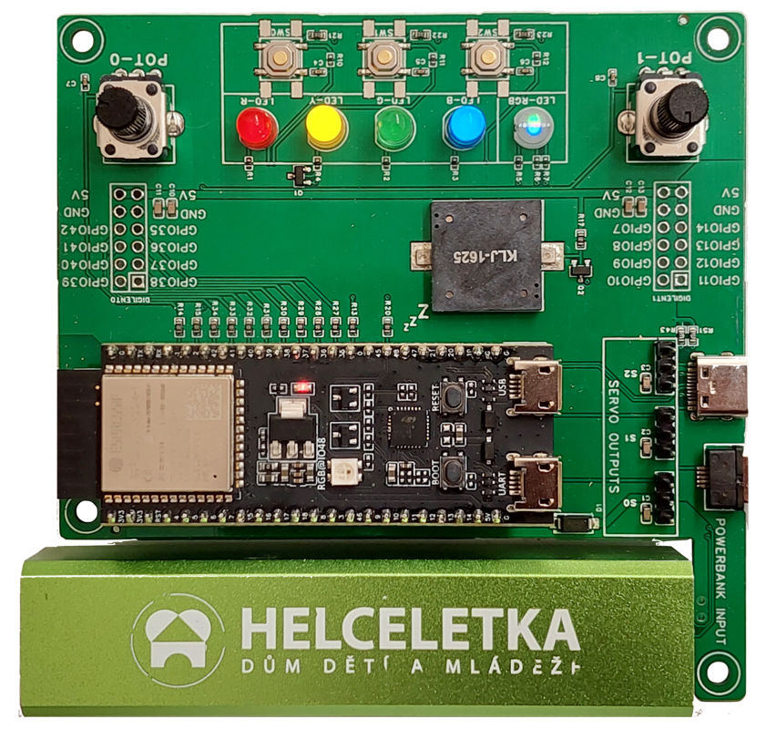
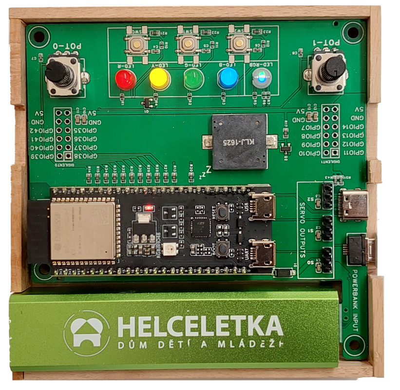
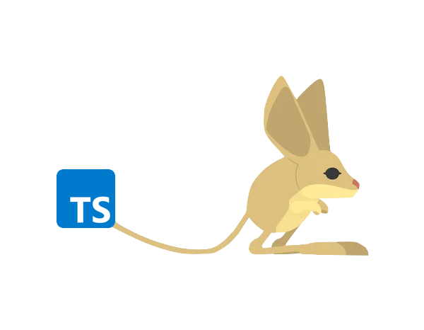

# ELKS (ESP Learning Kit Starter)

ELKS neboli **ESP Learning Kit Starter** je vývojová deska pro mikrokontrolér ESP32-S3.
Jedná se o vzdělávací nástroj pro výuku elektroniky a základů programování.
Kity používáme v kroužcích pro začátečníky i pokročilé.

Desku lze napájet pomocí USB kabelu nebo power banky připojené přímo k desce.

## Funkce:
- LED
- Tlačítka
- Potenciometry
- Piezo
- Servo výstupy
- Digilent PMOD konektory
- Konektor μŠup

## Programování:
Letos budeme vývojové desky programovat na platformě ESP32-S3. Pro programování budeme používat jazyk TypeScript, v kombinaci s knihovnou [Jaculus](https://jaculus.org/).

<div align="center">
    
    
</div>


??? info "Jak programovat"


    ### Blink example
    ``` ts
    import * as gpio from "gpio"; // (1)!

    const LED_PIN = 45; // (2)!

    gpio.pinMode(LED_PIN, gpio.PinMode.OUTPUT); // (3)!

    let state = false;

    setInterval(() => { // (4)!
        gpio.write(LED_PIN, state ? 1 : 0); // (5)!
        state = !state;
    }, 1000);
    ```

    1.  Import the GPIO module.
    2.  Configure the LED pin constant.
    3.  Set the pin mode to output.
    4.	Repeat the following code every second.
    5.  Toggle the LED state every second.


    
    <figure markdown>This is a caption</figure>

    
    <figure markdown>This is Espressif's logo</figure>