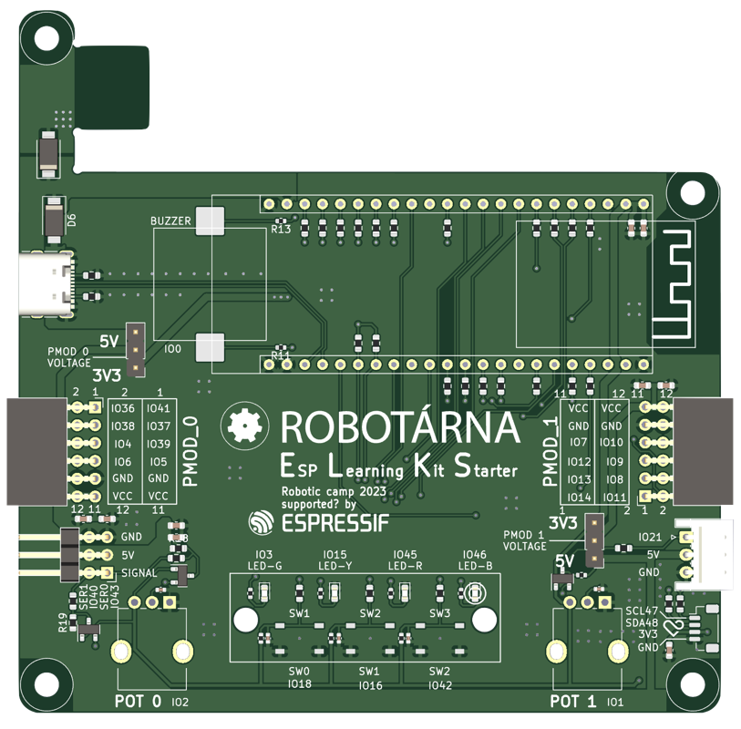

# ELKS (ESP Learning Kit Starter)

ELKS neboli **ESP Learning Kit Starter** je vývojová deska pro mikrokontrolér ESP32-S3.
Jedná se o vzdělávací nástroj pro výuku elektroniky a základů programování.
Kity používáme v kroužcích pro začátečníky i pokročilé.

Desku lze napájet pomocí USB kabelu nebo power banky připojené přímo k desce.

## Funkce:
- LED
- Tlačítka
- Potenciometry
- Piezo
- Servo výstupy
- Digilent PMOD konektory
- Konektor μŠup

## Programování:
Letos budeme vývojové desky programovat na platformě ESP32-S3. Pro programování budeme používat jazyk TypeScript, v kombinaci s knihovnou [Jaculus](https://jaculus.org/).

    
    

    

