# ELKS (ESP Learning Kit Starter)

Pro ELKS jsme vyvinuli krabičku, která z něj dělá mobilní interaktivní kouzlo. Tento návod Vám pomůže krabičku sestavit.

## Díly:
- Dřevíčka pro horní a spodní rámy
- Spodní překližka
- Horní plexisklo
- Distanční sloupky M3/8mm
- Šrouby M3
- Matky M3
- Tlačítkový modul
- Světlovody
- Hmatníky na tlačítka a potenciometry

## Návod na složení

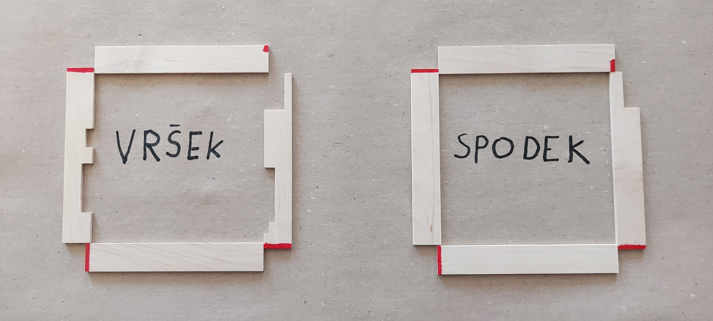
1. Dřevíčka pro stavbu rámů si rozložíme dle obrázku.

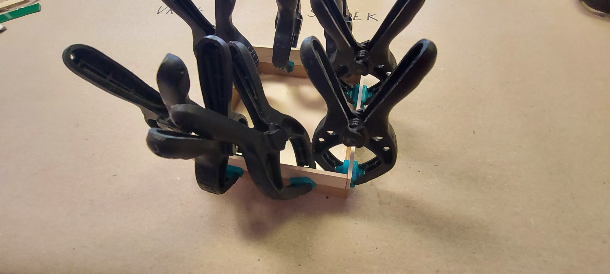
2. Za použití master krabičky a svorek sestavíme dřevíčka. Stykové plošky jsou znázorněné na předchozím obrázku.

3. Kapičkou lepidla přilepíme dřevíčka k sobě (avšak ne k masteru). Použijeme aktivátor.

4. Slepené rámy ještě pojistíme lepidlem.

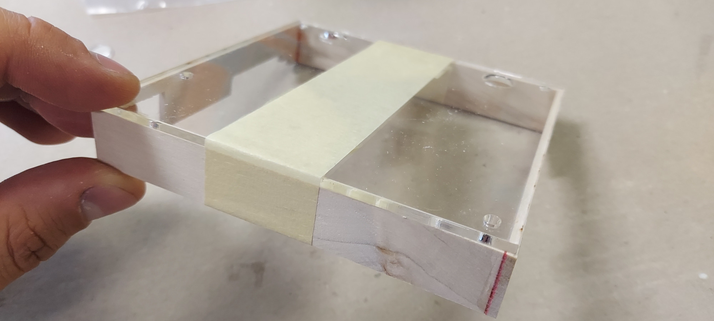
5. Na horní rám přesně nalepíme plexisklo (ve správném otočení). Můžeme nejdříve zajistit páskou.

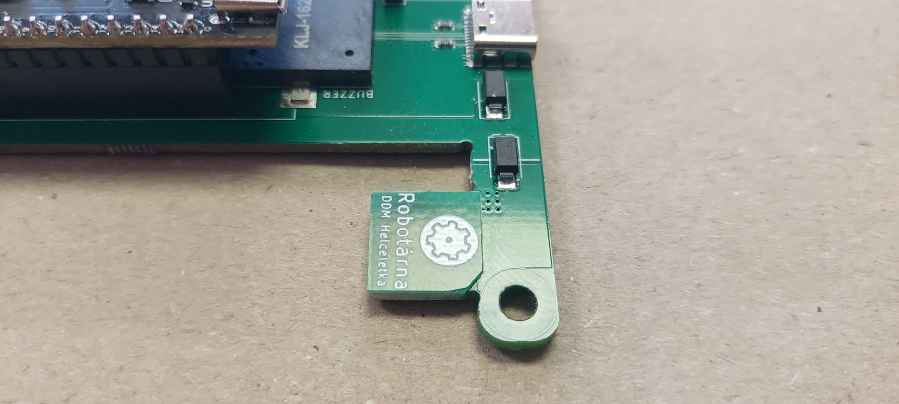
6. Na USB konektor nalepíme ztlusťovací destičku. Je doporučeno nejprve ubrousit rožek u montážní díry kvůli možné kolizi.

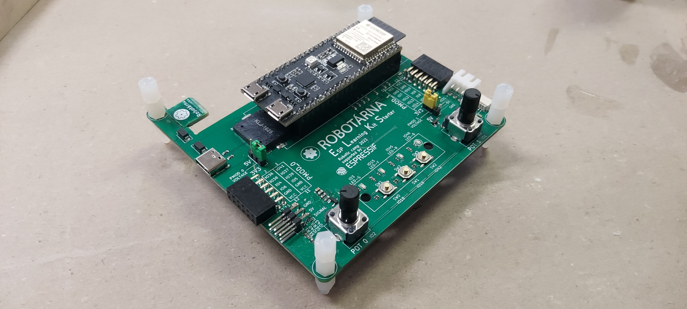
7. Do montážních děr ELKSu zašroubujeme distanční sloupky. Seshora dva na sebe, zdola jeden. Utáhneme fest.

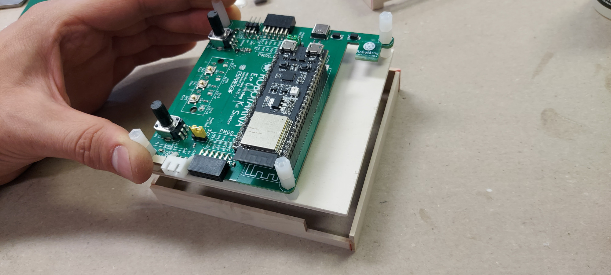
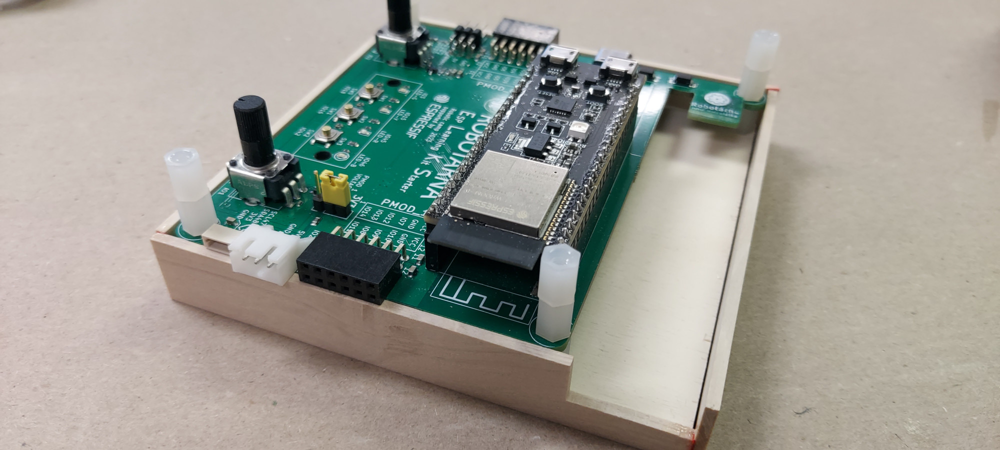
8. ELKS zasadíme do předvrtané překližky a následně do spodního rámu. DPS má zapadnout dovnitř.

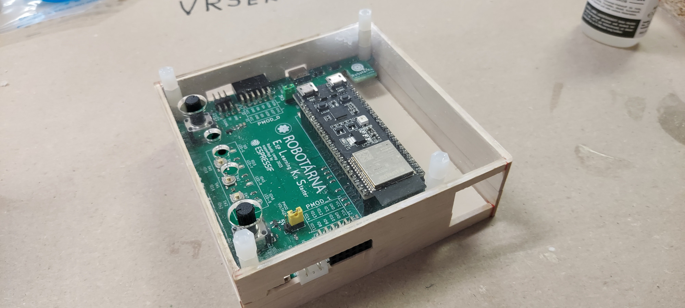
9. Zaklapneme horní díl krabičky a skrz plexisklo dočasně zašroubujeme další sloupky. Stačí lehce dotáhnout.

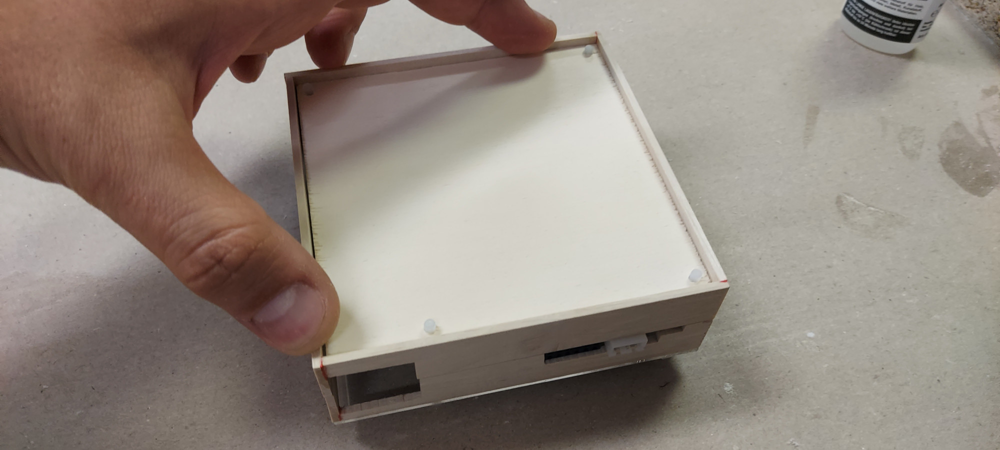
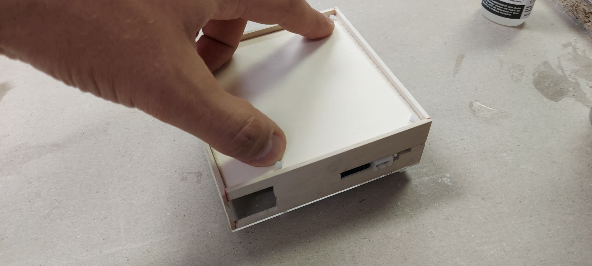
10. V obrácené poloze stlačíme rám a následně vnitřek krabičky.

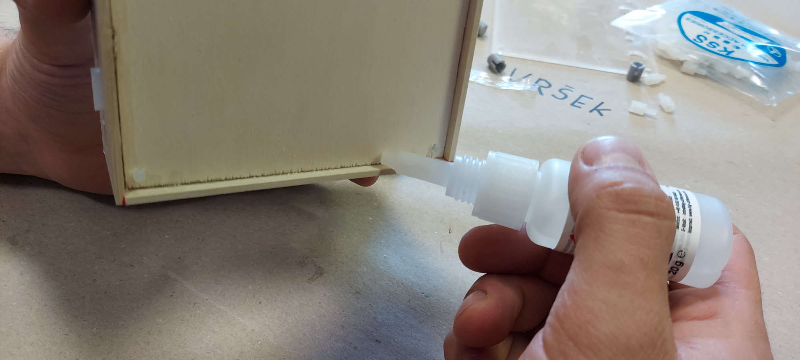
11. Ve svislé poloze bodově zalepíme spodní překližku. Použijeme aktivátor. Poté krabičku rozložíme a kout lepidlem kvalitně zalijeme.

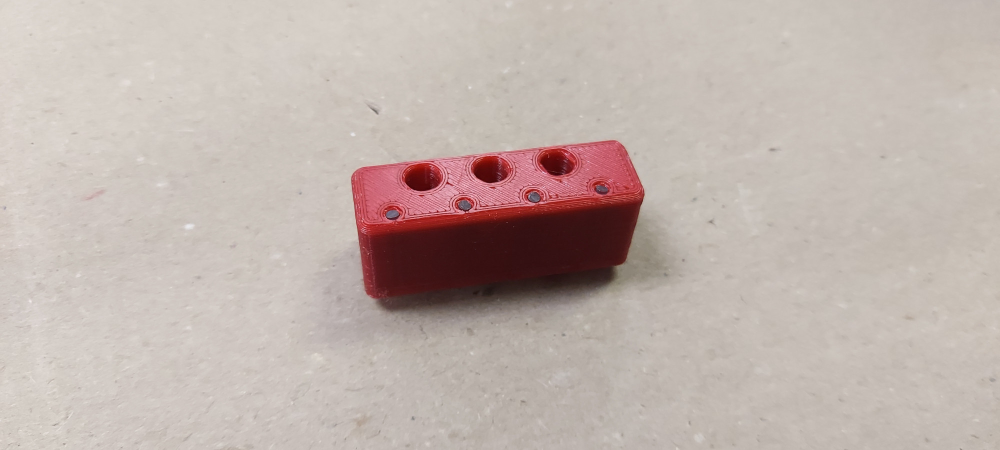

12. Do tlačítkového modulu vložíme 4 světlovody a zespoda 3 tlačítkové hmatníky.

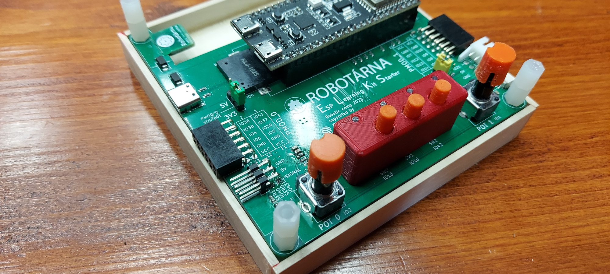
13. Tlačítkový modul vložíme na ELKS. Nasadíme také hmatníky na potenciometry.

14. Na spodní straně použijeme matičky k fixaci distančních sloupků.

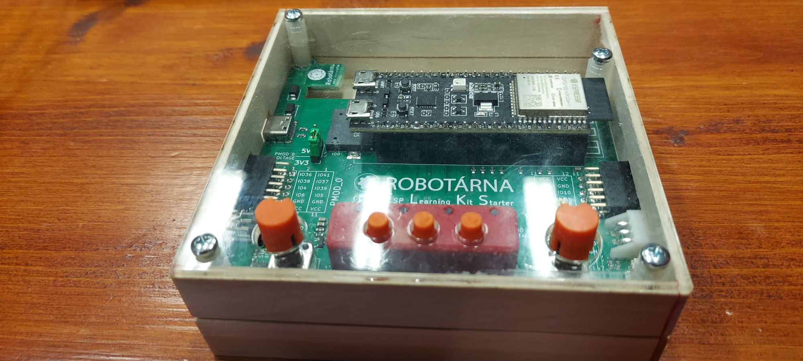
15. Krabičku zaklapneme a pomocí šroubů stáhneme dohromady. :)

