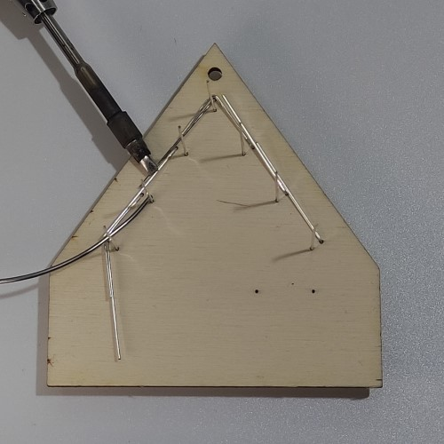
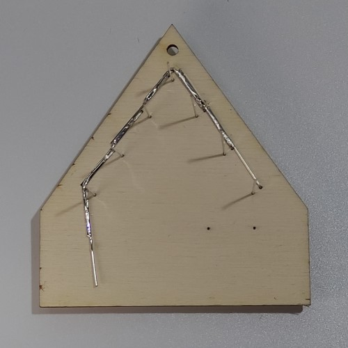
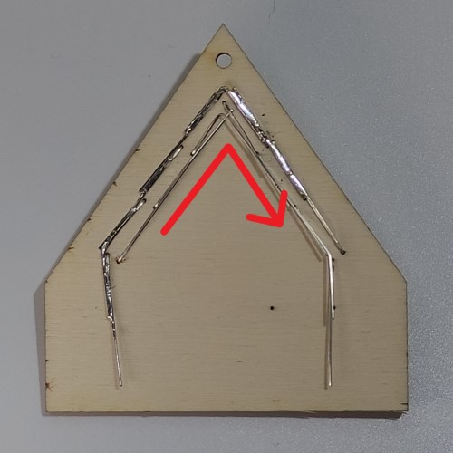
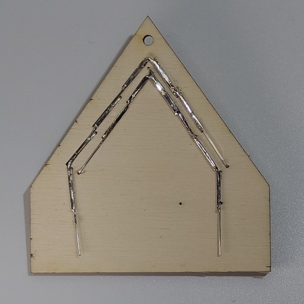
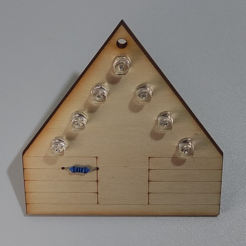
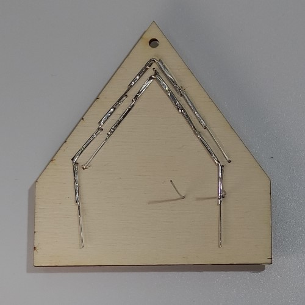
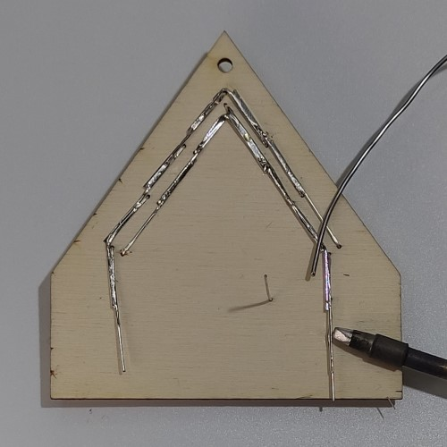

# Manuál

## Potřebný materiál
- Dřevěný dílek
- 7 LED
- 1 rezistor
- Držák baterie
- Baterie CR2032

## Návod na složení
 
1. Připravíme si potřebný materiál

 
2. Vložíme 2 LEDky podle znázornění na obrázku

 
3. LEDku dotlačíme k překližce

 
4. Ohneme vnější nožičku LEDky podle šipky

 
5. Vložíme a ohneme vnější nožičky všech ostatních LEDek

 
6. Ohnuté nožičky zapájíme dohromady

 
7. Vnější nožičky jsou zapájené

 
8. Ohneme všechny vnitřní nožičky LEDek

 
9. Zapájíme vnitřní nožičky LEDek dohromady

 
10. Vnitřní nožičky jsou zapájené

 
11. Vložíme rezistor podle obrázku a dotlačíme ho k překližce

 
12. Spodní pohled na desku

 
13. Ohneme vnější nožičku a připájíme k LEDkám

 
14. Zakrátíme nožičku rezistoru podle obrázku

 
15. Nachystáme si držák na baterii

 
16. Držák kapkou lepidla přilepíme k překližce jako na obrázku

 
17. K držáku baterií připájíme rezistor a nožičku LEDky

 
18. Zakrátíme nožičku rezistoru a LEDky podle obrázku

 
18. Vložíme baterku

 
20. Dokončený RoboSvit

